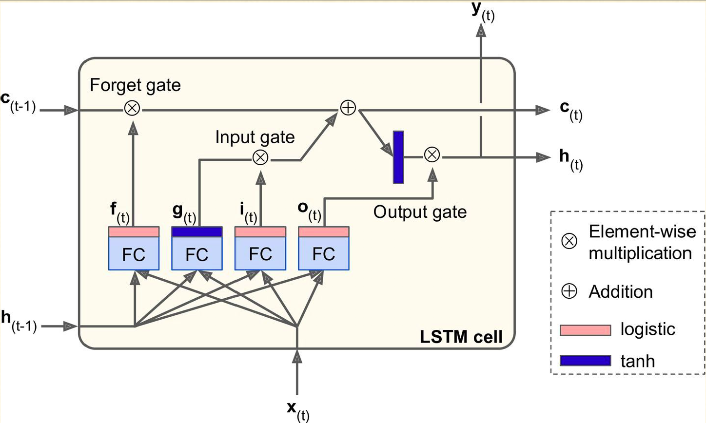

# Music-Generation-with-GAN
- - -

- - -

Generating music is notably different from generating images, texts or videos. The implicit complexity of modeling the sequence of notes and their corresponding frequencies to generate frequencies that are melodious, is a challenge of its own. While images and videos require extensive exploration of local patterns, each musical track embeds its own temporal dynamics, with a variety of notes, pitches, tones and other nuances that need to be accurately modelled. Many researchers have worked around this problem by using discrete symbolic representation of music which does not essentially capture such nuances. We take our cue from the success of Generative Adversarial Networks (GANs) and apply it to a continuous representation of music to generate melodies. In this project, we evaluate the performance of using different GAN architectures such as FCN-RNN and C-RNN GANs for music generation.